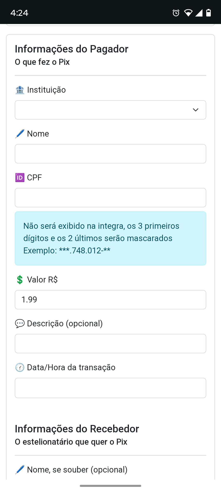
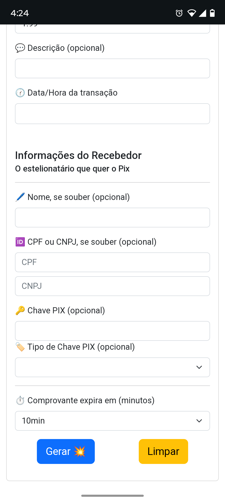
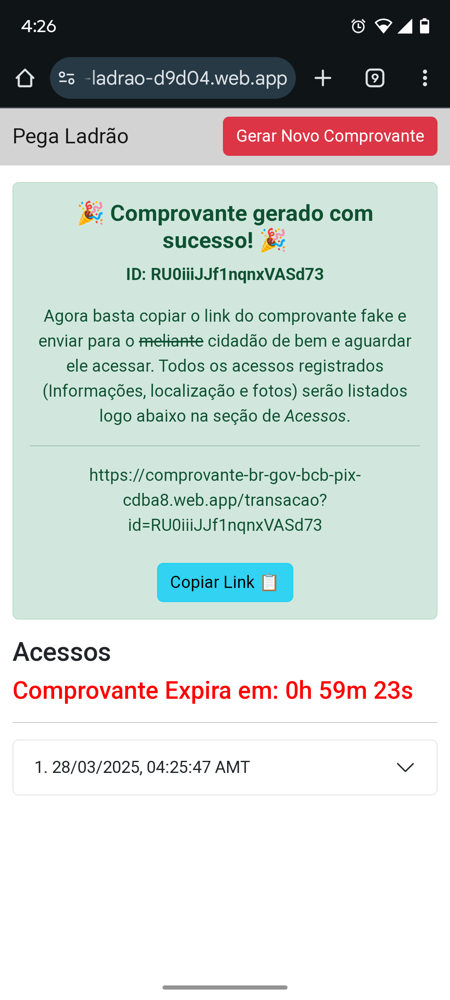
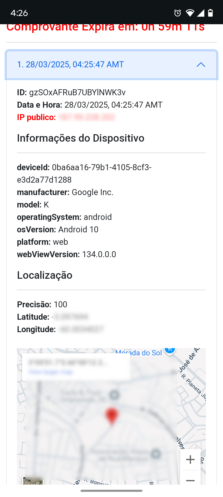
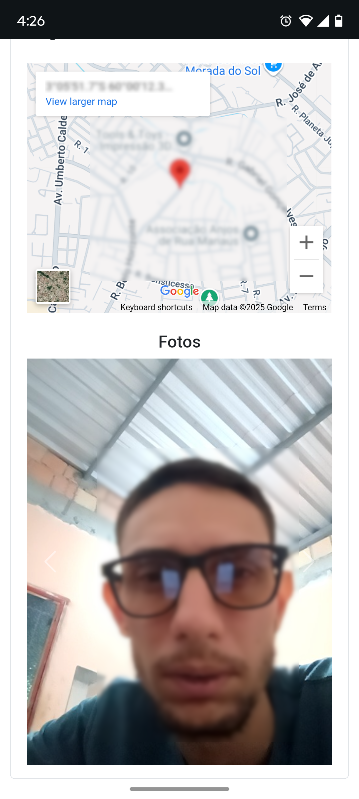

# Pega Ladrão

Não sou muito paciente para escrever as coisas mas aqui vai uma breve explicação do porque e como utilizar essa aplicação.

Recentemente vi um post do Pedro Teixeira ([link do repositório](https://github.com/PedroHBessa/backscan)) no LinkedIn onde ele contou como conseguiu obter, por meio de uma pagina simples, a localização de um criminoso que estava lhe ameaçando e pedindo dinheiro. Comentei que tinha feito algo parecido só que utilizando a plataforma Firebase, e como me pediram para deixar publico o repositório resolvi adaptá-lo para esse cenário disponibilizar aqui, além disso, publiquei no Firebase então vocês poderão usar.

Em resumo, com essa aplicação voce vai poder gerar comprovantes de Pix falso e enviar para o criminoso, caso ele acesse o link e conceda as permissões (somente para caso da localização e foto) você conseguirá obter a localização, IP, informações do dispositivo e até fotos do mesmo.

## Como usar

Como eu disse, disponibilizei online para qualquer pessoa usar. Criei dois domínios apontando para a mesma aplicação, **pega-ladrao-d9d04.web.app** é o domínio que você vai usar para gerar e obter os acessos ao comprovante e o **comprovante-br-gov-bcb-pix-cdba8.web.app** é que você vai enviar para criminoso.

Para gerar um comprovante acesso esse endereço:

[https://pega-ladrao-d9d04.web.app/_gerar](https://pega-ladrao-d9d04.web.app/_gerar)

Preencha o formulário e clique em gerar, se tudo foi devidamente preenchido você será redirecionado para uma página parecida com essa **https://pega-ladrao-d9d04.web.app/acessos?id=6wlAXyhqWCXxqLVVwv5m**.

Nesta página voce vai poder copiar o link do comprovante gerado para poder enviar, além disso é nessa pagina que será listado os acessos ao link com as informações. Essa pagina e atualizada a cada 30 segundos, onde ela busca da base do Firebase por novos acessos.

Devido o tempo corrido só fiz os modelos de comprovante, do banco Bradesco e do Next. Se você deseja contribuir desenvolvendo algum, ou ajudando na documentação, correção de Bugs ou de qualquer outra forma sinta-se livre para enviar um pull request ou abrir uma issue.
